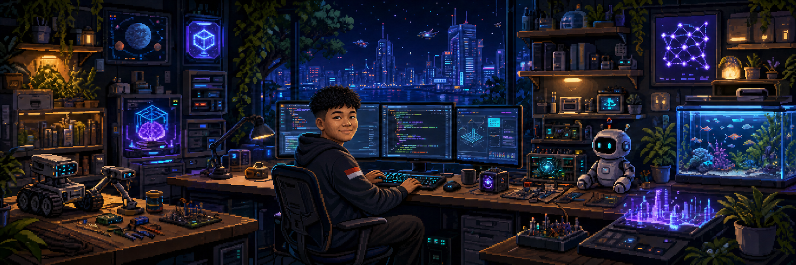

  

 

  <h1>Hi, I'm Rangga Egha Permana 👋</h1>
  <h3>Software Engineer building useful things with technology.</h3>
  

    I enjoy turning ideas into real products, solving practical problems, and continuously exploring new possibilities through technology.
  

  

    
    
  

---

## About Me

I'm a Software Engineer based in Karawang, Indonesia. I see technology as a tool for creating value, learning continuously, and transforming ideas into solutions that people can actually use.

- Building practical digital products from real-world ideas
- Exploring how software, AI, cybersecurity, and business can work together
- Learning through experimentation, collaboration, and open-source contributions
- Interested in technology that creates meaningful and measurable impact

## What I'm Exploring

My interests are intentionally broad and continue to evolve:

- **Product engineering** — turning ideas into reliable and useful products
- **Artificial intelligence** — exploring smarter ways to solve problems
- **Cybersecurity** — understanding how to build safer digital systems
- **Open source** — learning in public and contributing to shared technology
- **Technology and business** — connecting technical possibilities with real needs

## Selected Work

| Project | What it does |
| --- | --- |
| [OpsHub](https://github.com/RanggaEghaPermana/OpsHub) | Helps small businesses manage inventory, sales, invoices, customers, and reports from one dashboard. |
| [Music Player](https://github.com/RanggaEghaPermana/Music-Player) | An exploration of digital media experiences across a modern application stack. |
| [POS App](https://github.com/RanggaEghaPermana/POS-App) | A practical point-of-sale application designed around everyday transaction workflows. |
| [ReactAja contribution](https://github.com/amirsr43/react-aja/pull/4) | Improved the development toolchain security by upgrading Vite and resolving dependency advisories. |

## Tools in My Current Toolkit

  
  
  
  
  
  
  
  
  

## GitHub Activity

  
  

  

## Open-Source Journey

I contribute to open source to learn from real projects, collaborate with other builders, and leave the software ecosystem a little better than I found it. My contribution to [ReactAja](https://github.com/amirsr43/react-aja/pull/4) reduced its dependency audit findings from three vulnerabilities to zero.

## Let's Connect

  

---

  <em>Ship, learn, repeat.</em>

