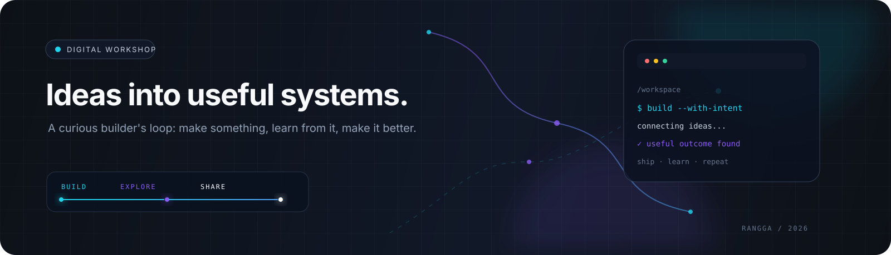

  

 

  <h1>Hi, I'm Rangga Egha Permana 👋</h1>
  
<strong>Software engineer turning ideas into useful systems.</strong>

  
Based in Karawang, Indonesia · building, exploring, and learning in public.

  

    
    
  

 

  <code>IDEA</code>&nbsp; → &nbsp;<code>BUILD</code>&nbsp; → &nbsp;<code>TEST</code>&nbsp; → &nbsp;<code>LEARN</code>&nbsp; → &nbsp;<code>REPEAT</code>

## What drives me

I like the space between an idea and something people can actually use. I build practical software, learn by experimenting, and keep refining how technology can create real value.

<table>
  <tr>
    <td width="33%" valign="top">
      <h3>⚡ Build</h3>
      
Turn ideas into thoughtful products, reliable systems, and interfaces that solve real problems.

    </td>
    <td width="33%" valign="top">
      <h3>◈ Explore</h3>
      
Stay curious about AI, security, systems, and the tools that expand what software can do.

    </td>
    <td width="33%" valign="top">
      <h3>↗ Share</h3>
      
Learn in public through experiments, open source, collaboration, and honest documentation.

    </td>
  </tr>
</table>

## Selected work

Different problems, same approach: understand the context, build with intent, and keep improving the result.

<table>
  <tr>
    <td width="50%" valign="top">
      
    </td>
    <td width="50%" valign="top">
      
    </td>
  </tr>
  <tr>
    <td width="50%" valign="top">
      
    </td>
    <td width="50%" valign="top">
      
    </td>
  </tr>
</table>

## Current toolkit

  <strong>Languages & UI</strong> 
  
  
  
  
  

  <strong>Backend & workflow</strong> 
  
  
  
  

## GitHub activity

  
  

 

  

## Learning in public

Side projects and open source are my way to turn curiosity into practice. I enjoy collaborating, improving real codebases, and documenting the lessons that come with building.

  <a href="https://github.com/amirsr43/react-aja/pull/4">View a recent open-source contribution →</a>

## Let's connect

  

 

  <em>Build with intent. Stay curious. Keep moving.</em>

